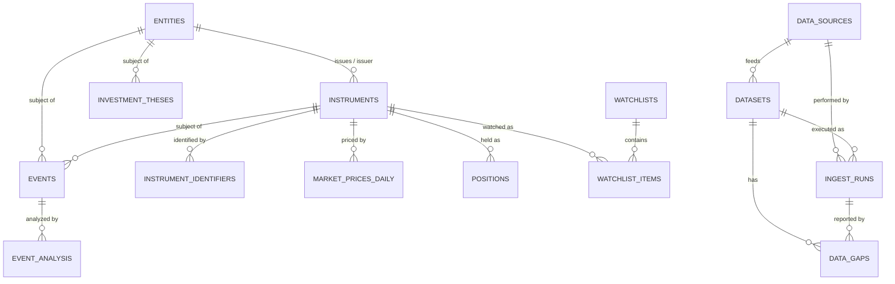

# Core Domain Model v1

> Market Monitor 核心领域模型 —— R1A 设计交付物
> 日期：2026-08-17 ｜ 状态：Design (not implemented) ｜ 作者：Market Monitor agent
> 配套文档：`database_schema_design_v1.md` / `data_dictionary_v1.md` / `storage_architecture_v1.md` / `daily_bars_migration_plan_v1.md` / `r1a_schema_review_v1.md`

---

## 0. 设计目标

建立能够长期稳定支撑以下四条主线关系的 canonical data model：

```
Company ──▶ Instrument ──▶ Market Data
Company ──▶ Event ──▶ AI Analysis
Company ──▶ Investment Thesis
Instrument ──▶ Portfolio / Watchlist
```

**核心原则：身份模型一旦错误，后续所有模块都会返工。因此 R1A 只做设计冻结，不实施。**

---

## 1. 六大 Domain

| Domain | 职责 | 核心表 | 解决的问题 |
|--------|------|--------|-----------|
| **A. Identity** | 资产身份 | `entities` `instruments` `instrument_identifiers` | “这个资产到底是谁？” |
| **B. Portfolio & Research State** | 持仓与研究状态 | `accounts`* `transactions`* `positions` `watchlists` `watchlist_items` `investment_theses` `thesis_versions`* | “Berlin 持有什么、关注什么、为什么关注、投资逻辑是什么？” |
| **C. Market Data** | 标准化行情 | `market_prices_daily` | 跨市场日线行情的 canonical 存储 |
| **D. Fundamentals** | 财务数据 | `financial_reports`* `financial_facts`* | 多 provider 财务事实统一模型 |
| **E. Events & Intelligence** | 事件与智能 | `events` `event_analysis` `alerts`* | 事件事实 ≠ 模型判断 |
| **F. Data Operations** | 数据运营 | `data_sources` `datasets` `ingest_runs` `data_gaps` `raw_artifacts`* | 数据从哪来、成败、缺什么、证据在哪 |

\* = Deferred（仅接口设计，R1 不实施）

现有 `daily_bars`（Tushare source-specific）被判定为 **legacy implementation**，不是长期 canonical 身份/行情模型，迁移方案见 `daily_bars_migration_plan_v1.md`。

---

## 2. 核心对象定义

### 2.1 Entity（现实经济主体）

代表真实世界的经济主体：Tencent Holdings、NVIDIA Corporation、Apple、中国政府、美联储。

- 公司事件（财报、并购、高管变动）**原则上关联 Entity**。
- Entity 可以有多个 Instrument（0700.HK + TCEHY 都指向 Tencent Holdings）。
- Entity 是 `investment_theses` 的挂载点（投资逻辑针对公司，不针对单一 ticker）。

### 2.2 Instrument（可交易/可报价的金融工具）

代表可被市场交易、报价或跟踪的工具：0700.HK、TCEHY、NVDA、SOXX、SPY、S&P 500 Index、USDJPY、期货、期权。

- 价格、持仓、交易**原则上关联 Instrument**。
- `instrument_type` 覆盖：EQUITY / ADR / ETF / INDEX（R1 主力），预留 FX / FUTURE / OPTION / BOND / COMMODITY / CRYPTO（不建复杂 subtype schema）。
- 同一 Entity 可发行多个 Instrument；同一 Instrument 的 provider 标识（ts_code / fmp_symbol / yahoo_symbol）**不得**硬编码在 instruments 表。

### 2.3 Identifier（provider 中立标识）

`instrument_identifiers` 独立成表，解决：

- 唯一性（同 provider 同 identifier 只能映射一个 instrument）
- ticker 变更（valid_from / valid_to）
- 跨 provider mapping（TUSHARE ts_code、FMP symbol、ISIN、CUSIP…）
- ticker 重用（历史上不同公司用过同一 ticker → 靠 validity 区间区分）
- delisted assets（标识保留，instrument.status='DELISTED'）
- provider identifier 与 exchange symbol 的区别（`identifier_type` 区分 'TICKER' 与 'EXCHANGE_SYMBOL'）

---

## 3. Core vs Deferred 划分

### 3.1 Core —— R1 冻结设计（进入 R1B DDL）

| 表 | Domain | 说明 |
|----|--------|------|
| `entities` | A | 经济主体身份 |
| `instruments` | A | 金融工具身份 |
| `instrument_identifiers` | A | provider 中立标识 |
| `data_sources` | F | provider 定义 |
| `datasets` | F | 逻辑数据集定义 |
| `ingest_runs` | F | 抓取运行审计 |
| `data_gaps` | F | 缺口登记 |
| `watchlists` | B | 自选列表 |
| `watchlist_items` | B | 自选条目（instrument + 关注理由） |
| `positions` | B | 当前持仓快照 |
| `investment_theses` | B | 投资逻辑 |
| `market_prices_daily` | C | 标准化日线 |
| `events` | E | 事件事实 |
| `event_analysis` | E | LLM 分析 |

另加 infra 表：`schema_migrations`（见 §7）。

### 3.2 Deferred —— 仅接口设计，R1 不实施

| 表 | Domain | 暂缓理由 |
|----|--------|---------|
| `accounts` | B | 无多账户/券商接入需求；positions 用 `account_ref` 文本暂代 |
| `transactions` | B | 完整交易历史是 R2+ 需求；positions 已可独立工作 |
| `thesis_versions` | B | 版本系统是增强项；thesis 本身已含 updated_at 可回查近期变化 |
| `financial_reports` `financial_facts` | D | 本轮无财务数据源接入（FMP/SEC 未接） |
| `alerts` | E | R6 Alert System 才实施 |
| `raw_artifacts` | F | 原始证据存档；R1 的 ingest_runs + source_reference 已够用 |

**调整说明**：任务给出的 Core 列表全部保留，未做调整；`thesis_versions` 与 `financial_*` 保持 Deferred，因为当前没有数据源与使用场景驱动它们。若未来 FMP 接入，`financial_reports`/`financial_facts` 将是第一批升级为 Core 的表。

---

## 4. 对象关系与 ER Diagram

### 4.1 关系链（文字版）

```
ENTITY ──1:N──▶ INSTRUMENT            （一个公司多个工具；instrument.entity_id 可空：指数/FX 无 entity）
ENTITY ──1:N──▶ INVESTMENT_THESIS     （thesis 挂 entity，不挂 ticker）
INSTRUMENT ──1:N──▶ POSITION          （private.db，跨库引用无 FK）
WATCHLIST ──1:N──▶ WATCHLIST_ITEM ──N:1──▶ INSTRUMENT
INSTRUMENT ──1:N──▶ MARKET_PRICE_DAILY
INSTRUMENT ──1:N──▶ INSTRUMENT_IDENTIFIER
ENTITY ──1:N──▶ EVENT ──1:N──▶ EVENT_ANALYSIS
                 EVENT ──N:1──▶ INSTRUMENT（可选）
DATA_SOURCE ──1:N──▶ DATASET ──1:N──▶ INGEST_RUN
DATA_SOURCE ──1:N──▶ INGEST_RUN
DATASET ──1:N──▶ DATA_GAP；INGEST_RUN ──1:N──▶ DATA_GAP
```

**Optional FK 说明：**
- `instruments.entity_id` —— NULL：纯指数（如 S&P 500 Index 无单一发行主体）或暂无映射。
- `events.entity_id` —— NULL：宏观/市场级事件（美联储利率决议没有单一公司 entity，可指向 GOVERNMENT 类 entity 或留空）。
- `events.instrument_id` —— NULL：非个股特定事件。
- `watchlist_items.instrument_id` / `positions.instrument_id` / `investment_theses.entity_id` —— 跨库引用（private.db → core.db），SQLite 不支持跨库 FK 约束，唯一性/存在性由应用层保证（见 `storage_architecture_v1.md` §3）。

### 4.2 Mermaid ER Diagram



> 注：`POSITIONS` / `WATCHLIST_ITEMS` / `INVESTMENT_THESES` 位于 private.db，与 core.db 的关系是**跨库引用（无 FK 约束）**，图中用连线表达逻辑关系而非物理约束。

---

## 5. 关键设计原则（贯穿全 schema）

1. **Entity ≠ Instrument**：ticker 不是身份。所有跨 provider 的身份问题走 `instrument_identifiers`。
2. **事件事实 ≠ AI 判断**：`events` 只存确定性事实（Python/人工录入），LLM 输出一律进 `event_analysis`（含 model_id / prompt_version / analysis_version，可复现）。
3. **raw / normalized 分离**：provider 原始字段名保留（`original_metric_name`），canonical 字段走受控字典（`metric_key`）。
4. **显式 unit / currency / adjustment**：不隐含默认。volume、turnover 带 unit 列；价格带 currency；行情带 adjustment_type。
5. **时间戳全 UTC + 显式语义**：`*_at` 一律 UTC ISO-8601；日历日期（trade_date / period_end / as_of_date）用 DATE 无时区；事件另有 `event_timezone`。
6. **不可变 vs 可变**：raw 证据原则上不覆盖（raw_artifacts Deferred）；provider 重新发布的日线走受控 upsert（见 review 文档 Finding 10 的决议）。
7. **public / private 物理分离**：持仓/成本/账户/自选/研究逻辑进 private.db，不进 Git、不混入公开 schema 提交。
8. **ID 统一 integer surrogate**：所有表 `INTEGER PRIMARY KEY`（SQLite ROWID 别名）+ 业务唯一键约束。理由见 §6.1。
9. **不过度设计**：不为 enum 建大量 lookup 表（用 SQL CHECK + 应用层常量）；不为未来类型建 subtype schema；JSON 只用于 flexible metadata 与 LLM 结构化输出。

---

## 6. 统一设计标准

### 6.1 ID 方案 —— 推荐 integer surrogate

| 方案 | 优点 | 缺点 | 结论 |
|------|------|------|------|
| Integer surrogate (ROWID) | SQLite 原生、索引小、外键简单、日志可读、自增有序 | 跨库合并/同步需小心；泄露"数量级"信息 | **✅ 推荐** |
| UUID (v4) | 全局唯一、可离线生成 | 索引大、随机无序、调试困难、SQLite 无原生类型 | ❌ 本项目单机单写，无分布式合并需求 |
| ULID | 有序、可排序、可读性好 | 需自己实现、生态少、收益对本项目不明显 | ❌ 可作未来外部引用 ID（如事件公共 ID）时的备选 |

**决策**：全表 `INTEGER PRIMARY KEY`。业务唯一性一律用显式 UNIQUE 约束（如 `UNIQUE(provider, identifier_type, identifier) WHERE valid_to IS NULL`）。若未来需要对外稳定的公共 ID（例如事件 ID 被外部系统引用），再为个别表加 nullable `public_id TEXT UNIQUE` 列，不改变主键。

### 6.2 Timestamp / Date 语义

| 类型 | 存储 | 示例 | 说明 |
|------|------|------|------|
| Instant（时刻） | TEXT UTC ISO-8601 | `2026-08-17T02:30:00Z` | `created_at` `updated_at` `detected_at` `ingested_at` `started_at` `finished_at` `added_at` |
| Calendar date（日历日） | TEXT `YYYY-MM-DD` | `2026-08-17` | `trade_date` `event_date` `period_end` `report_date` `listing_date` `as_of_date` `valid_from/to` |
| Event 本地时区 | TEXT IANA | `Asia/Shanghai` | `events.event_timezone`（记录事件原始时区，配合 event_time 使用） |

原则：**不使用无时区语义的 ambiguous timestamp**。凡"时刻"必带 UTC；凡"日期"必是明确日历语义；事件同时记录发生时刻（UTC）与原始时区。

### 6.3 Currency / Unit / Country / Adjustment

- Currency：ISO 4217 大写三字母（`USD` `HKD` `CNY` `JPY`）。
- Country：ISO 3166-1 alpha-2（`CN` `HK` `US`）。
- Exchange：ISO 10383 MIC（`XSHG` `XSHE` `XHKG` `XNYS` `XNAS`），非交易所用哨兵值 `NONE`。
- Volume / Turnover：**必须显式标注单位列**（`volume_unit` `turnover_unit`）。
  - 已知陷阱：Tushare `daily.vol` 单位是**手**（100 股），`daily.amount` 单位是**千元**。canonical 表存 provider raw 数值 + 显式 unit（`LOTS` / `THOUSAND_CNY`），换算一律在查询/展示层，入库不做隐式换算。
- Adjustment：`adjustment_type` ∈ `RAW`（不复权）/ `FWD`（前复权）/ `BWD`（后复权）/ `NONE`（不适用）。Tushare `daily` 原始接口 = `RAW`。

### 6.4 Enum 策略

- **SQL CHECK**：稳定、封闭、短列表（`instrument_type`、`adjustment_type`、`status` 类、unit 类）。
- **应用层常量**：Python 模块定义与 CHECK 同步的常量（避免散落字符串）。
- **Lookup 表**：仅用于**会增长**的受控字典。R1 不建 lookup 表；`event_type` 与未来 `metric_key` 在 R1 用受控清单 + CHECK，当类型数增长到不可维护时（预计 R4/R5）再升级为 lookup 表。

### 6.5 JSON 使用边界

允许：`run_metadata`（抓取参数）、`tags`（watchlist 标签数组）、`key_metrics`/`key_catalysts`/`key_risks`（thesis 结构化数组）、`thesis_impact`（事件对 thesis 影响映射）、`bullish_points`/`bearish_points`/`key_changes`（LLM 结构化输出）、`raw_output`（模型原始输出证据）、provider payload 元数据。

禁止：高频查询核心 key、FK 目标、canonical 数值指标（如 revenue 不得放 JSON 里）、需要 JOIN/排序/约束的字段。

---

## 7. Schema Versioning（轻量）

- `schema_migrations(migration_id TEXT PK, applied_at TEXT NOT NULL, description TEXT, checksum TEXT)`。
- 当前版本 = `MAX(migration_id)`；每次 schema 变更 = 一条递增 migration 记录。
- R1B 推荐：**手写 SQL migration 文件 + 纯标准库 Python runner**（项目零第三方依赖原则，与 fetch_daily.py 一致）。不引入 Alembic（本轮不安装任何依赖；若未来 schema 复杂度显著上升再评估）。

---

## 8. 开放问题（需 Berlin 确认，不阻塞 R1A 冻结）

1. **sector / industry 归属**：R1 不进 entities 表（属 mutable classification），等 R2+ 建 `entity_classifications`。若 Berlin 现在就想要行业维度，可提前升级。
2. **positions 是否需要多账户**：R1 按"单账户为主 + account_ref 文本"设计；若 Berlin 已有 IBKR + 券商多账户需求，positions 的 UNIQUE 设计要调整。
3. **watchlist 是否需要 entity 级条目**（关注公司而非单一 instrument）：R1 用 `watchlist_items.entity_id` 可选列覆盖，但 UNIQUE 目前按 instrument 约束。
4. **market_prices_daily 的 upsert 策略**：R1 允许 provider 重新发布时受控覆盖同键行（与现有 fetch_daily.py 行为一致）；若 Berlin 要求严格不可变 + 版本化，需要提前加 `price_revisions` 表设计。

（以上问题同时写入 PROJECT_STATUS 的 Blockers 区，供 Berlin 决策。）
