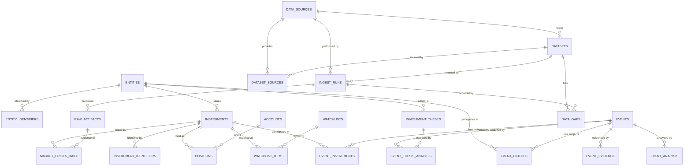

# Core Domain Model v2 — Freeze Candidate

> Market Monitor 核心领域模型 —— R1A.1 修订交付物
> 日期：2026-08-22 ｜ **Status: FREEZE CANDIDATE — NOT YET APPROVED**
> 本文件为设计候选，**尚未冻结**。Berlin 审查通过后方可标记 Frozen，并授权 R1B。
> 基于 `core_domain_model_v1.md` 修订；**v1 保留不覆盖**。
> 配套：`database_schema_design_v2_freeze_candidate.md` / `data_dictionary_v2_freeze_candidate.md` / `storage_architecture_v2_freeze_candidate.md` / `daily_bars_migration_plan_v2_freeze_candidate.md` / `r1a1_schema_review_v2.md` / `database_design_decisions_v1.md`

---

## 0. 与 v1 的关系

v1（2026-08-17）为 R1A 设计基线。本文件落实 R1A.1 Schema Corrections **B1–B14**，全部为**设计修订，不实施**：

| 修正 | 主题 | 核心变化 |
|------|------|---------|
| B1 | Entity Identifiers | 新增 `entity_identifiers`（SEC_CIK / LEI / provider_company_id）；LEI、SEC CIK 属 Entity |
| B2 | canonical_name | 不再 UNIQUE；仅展示/搜索名，身份由 entity_uid + entity_identifiers 承担 |
| B3 | Stable UID | 新增 `entity_uid` / `instrument_uid` / `event_uid`（+ account/artifact/evidence uid），UUIDv4；INTEGER PK 仅作单库 surrogate |
| B4 | Watchlist XOR | entity_uid / instrument_uid 恰好一个非 NULL（CHECK），分别防重复 |
| B5 | Accounts 提升 Core | accounts 入 private.db Core（不存 password/token） |
| B6 | Positions 修正 | account_id NOT NULL + instrument_uid NOT NULL；SNAPSHOT；OPEN unique 重设计 |
| B7 | Analysis 分离 | core `event_analysis` 仅 generic；private 新增 `event_thesis_analysis` |
| B8 | Alerts 移入 private | alerts 不再是 PUBLIC core 表 |
| B9 | 数据集源优先级 | 新增 `dataset_sources`；删除 data_sources.priority 的 canonical 含义 |
| B10 | 多主体事件 | 新增 `event_entities` / `event_instruments`（PRIMARY/ACQUIRER/TARGET/ISSUER/AFFECTED/RELATED） |
| B11 | 多源证据 | 新增 `event_evidence`（HKEX/SEC/IR/NEWS/API/MANUAL） |
| B12 | Raw Artifacts 提升 Core | `raw_artifacts` 从 Deferred 升为 R1 Core |
| B13 | 行情血缘 | `market_prices_daily.ingest_run_id`（+ 可选 raw_artifact_id） |
| B14 | Legacy 迁移溯源 | legacy DB 备份 + 注册 raw_artifact + SHA-256；normalized completeness + raw provenance completeness |

每条修正的决策记录见 `database_design_decisions_v1.md`（DB-D001–DB-D015）。

---

## 1. 设计目标（不变）

四条主线关系：

```
Company ──▶ Instrument ──▶ Market Data
Company ──▶ Event ──▶ Analysis
Company ──▶ Investment Thesis
Instrument ──▶ Portfolio / Watchlist
```

核心原则：**身份模型一旦错误，后续所有模块都会返工**。v2 在 v1 基础上强化：身份稳定（UID）、主体关系可多可溯源（event_entities / event_evidence）、隐私边界物理化（core/private 分库 + alerts/thesis analysis 归 private）。

---

## 2. 六大 Domain（更新）

| Domain | 职责 | 核心表 | 变化（相对 v1） |
|--------|------|--------|----------------|
| **A. Identity** | 资产身份 | `entities` `entity_identifiers` `instruments` `instrument_identifiers` | 新增 entity_identifiers；全表加稳定 UID；canonical_name 去 UNIQUE |
| **B. Portfolio & Research State** | 持仓与研究状态 | `accounts` `positions` `watchlists` `watchlist_items` `investment_theses` `event_thesis_analysis` `alerts` | accounts 升 Core；alerts 移入；新增 event_thesis_analysis；positions 修正 |
| **C. Market Data** | 标准化行情 | `market_prices_daily` | 增加 ingest_run_id / raw_artifact_id 血缘 |
| **D. Fundamentals** | 财务数据 | `financial_reports`* `financial_facts`* | 仍 Deferred |
| **E. Events & Intelligence** | 事件与智能 | `events` `event_entities` `event_instruments` `event_evidence` `event_analysis` | 多主体 + 多源证据；analysis 拆分 generic/private |
| **F. Data Operations** | 数据运营 | `data_sources` `datasets` `dataset_sources` `ingest_runs` `raw_artifacts` `data_gaps` | dataset_sources 新增；raw_artifacts 升 Core |

\* = Deferred（仅接口设计，R1 不实施）

---

## 3. 核心对象定义（更新）

### 3.1 Entity（现实经济主体）

Tencent Holdings / NVIDIA / 美联储 / 中国政府。

- 公司事件、thesis **原则上关联 Entity**。
- **Entity 级标识（B1）**：LEI、SEC CIK、provider 内部公司 ID 属于 Entity，进 `entity_identifiers`（如 `(LEI, 549300...)`、`(SEC_CIK, 0001045810)`）。
- **identity（B2/B3）**：`entity_id`（INTEGER，单库 surrogate）+ `entity_uid`（UUIDv4，跨库稳定身份）。`canonical_name` 只是当前展示/搜索名，**可重名，不唯一**。
- Entity 可有多个 Instrument（0700.HK + TCEHY → Tencent）。

### 3.2 Instrument（可交易/可报价金融工具）

0700.HK / TCEHY / NVDA / SOXX / SPY / S&P 500 Index / USDJPY / 期货 / 期权。

- 价格、持仓、交易**原则上关联 Instrument**。
- `instrument_type`：EQUITY / ADR / ETF / INDEX（R1 主力），预留 FX / FUTURE / OPTION / BOND / COMMODITY / CRYPTO。
- **identity（B3）**：`instrument_id`（INTEGER surrogate）+ `instrument_uid`（UUIDv4 稳定身份）。
- **Instrument 级标识**：ticker / ISIN / FIGI / CUSIP / SEDOL / exchange symbol 属于 Instrument（`instrument_identifiers`）——**与 Entity 标识严格分属**（B1）。

### 3.3 Identifier（provider 中立标识）

| 归属 | 表 | 示例 |
|------|----|------|
| **Entity** | `entity_identifiers` | LEI、SEC_CIK、provider_company_id（FMP cik / Tushare symbol 公司级） |
| **Instrument** | `instrument_identifiers` | TICKER（ts_code / fmp_symbol）、EXCHANGE_SYMBOL、ISIN、CUSIP、SEDOL、FIGI |

两者共用设计模式：provider + identifier_type + identifier + valid_from/to + is_primary；partial unique 保证"当前有效"映射唯一；ticker 重用/变更靠 validity 区间。

### 3.4 Event（事件事实，多主体 + 多源证据）

- `events` 只存确定性事实（event_uid、fingerprint 去重、event_type、time、title/summary、source、status）。
- **多主体（B10）**：事件 ↔ Entity 关系进 `event_entities`（role：PRIMARY / ACQUIRER / TARGET / ISSUER / AFFECTED / RELATED）；事件 ↔ Instrument 关系进 `event_instruments`（同 role 集）。`events` **不再设单一 entity_id 列**，杜绝"唯一主体"假设与身份冲突。
- **多源证据（B11）**：一个 normalized event 可对应 HKEX filing / SEC filing / company IR / news / API payload / manual evidence，全部进 `event_evidence`（content_hash 去重、is_primary 标记主证据、source_reference 可回溯）。
- 宏观事件（美联储利率决议）可以是零 entity、零 instrument，只有 evidence + analysis。

### 3.5 Analysis（判断层：generic / private 严格分离）

- **core.db `event_analysis`（B7）**：只做 **generic market/event analysis**（importance、summary、bullish/bearish points、recommended_attention、model 信息）。**禁止** thesis_id、私人持仓、portfolio relevance、私人 investment thesis。
- **private.db `event_thesis_analysis`（B7）**：`event ↔ investment_thesis` 私人分析：impact_direction、impact_severity、reasoning_summary、invalidate_triggered、recommended_attention、model/prompt/analysis version、raw_output。
- **alerts（B8）**：属于 PRIVATE / RUNTIME USER STATE，移入 private.db。

### 3.6 Data Operations（数据运营，血缘完整化）

- `data_sources`：provider 定义。`priority` 列**不再有 canonical 含义**（B9），仅保留为一般备注字段（或弃用）。
- `datasets`：逻辑数据集（CN_EQUITY_DAILY / US_EQUITY_DAILY / US_FILINGS…）。
- **`dataset_sources`（B9）**：数据集 × 数据源 × 优先级角色：

  | dataset_code | source | priority_role |
  |--------------|--------|---------------|
  | CN_EQUITY_DAILY | TUSHARE | PRIMARY |
  | CN_EQUITY_DAILY | FMP | FALLBACK |
  | US_EQUITY_DAILY | FMP | PRIMARY |
  | US_EQUITY_DAILY | ALPHA_VANTAGE | FALLBACK |
  | US_FILINGS | SEC | PRIMARY |

- `ingest_runs`：每次抓取审计。
- **`raw_artifacts`（B12，Core）**：canonical 数据的原始证据（文件/URL/API payload/DB 快照），带 content_hash（SHA-256），供完整追溯。
- **`market_prices_daily` 血缘（B13）**：每行记录 `ingest_run_id`（+ 可选 `raw_artifact_id`），可回答"这条行情是哪次 ingest、哪个 source、哪个 raw artifact"。
- `data_gaps`：缺口登记。

---

## 4. Core vs Deferred（v2 Freeze Candidate）

### 4.1 core.db —— Core（PUBLIC，17 张，含 infra）

| 表 | Domain | 说明 |
|----|--------|------|
| `entities` | A | 经济主体（+ entity_uid；canonical_name 非唯一） |
| `entity_identifiers` | A | **新增**：Entity 级标识（LEI/SEC_CIK/provider_company_id） |
| `instruments` | A | 金融工具（+ instrument_uid） |
| `instrument_identifiers` | A | Instrument 级标识（ticker/ISIN/CUSIP/FIGI/…） |
| `data_sources` | F | provider 定义（priority 不再 canonical） |
| `datasets` | F | 逻辑数据集定义 |
| `dataset_sources` | F | **新增**：数据集 × 源 × PRIMARY/FALLBACK 角色 |
| `ingest_runs` | F | 抓取运行审计 |
| `raw_artifacts` | F | **提升 Core**：原始证据存档（SHA-256） |
| `data_gaps` | F | 缺口登记 |
| `market_prices_daily` | C | 标准化日线（+ ingest_run_id / raw_artifact_id） |
| `events` | E | 事件事实（+ event_uid；无单一 entity_id） |
| `event_entities` | E | **新增**：事件 ↔ Entity 多主体关系（role） |
| `event_instruments` | E | **新增**：事件 ↔ Instrument 多主体关系（role） |
| `event_evidence` | E | **新增**：多源证据（content_hash 去重） |
| `event_analysis` | E | generic 事件分析（无 thesis 字段） |
| `schema_migrations` | infra | 迁移记录 |

### 4.2 private.db —— Core（PRIVATE，7 张）

| 表 | Domain | 说明 |
|----|--------|------|
| `accounts` | B | **提升 Core**（原 Deferred）：账户定义，无 password/token |
| `positions` | B | 持仓快照（account_id + instrument_uid NOT NULL） |
| `watchlists` | B | 自选列表 |
| `watchlist_items` | B | 自选条目（entity_uid XOR instrument_uid） |
| `investment_theses` | B | 投资逻辑（挂 entity_uid） |
| `event_thesis_analysis` | B | **新增**：事件 ↔ thesis 私人分析 |
| `alerts` | E | **移入 private**：运行时用户状态 |

### 4.3 Deferred —— 仅接口设计，R1 不实施

`transactions`（canonical ledger）、`thesis_versions`、`financial_reports`、`financial_facts`。

---

## 5. UID 策略（B3，明确选择）

**选择：UUIDv4（Python stdlib `uuid.uuid4()`，TEXT 36 字符小写带连字符）。**

| 方案 | 结论 | 理由 |
|------|------|------|
| **UUIDv4** | ✅ **采纳** | Python ≥3.10 标准库原生支持；零依赖；离线可生成；碰撞概率可忽略；重建 core.db 后 UID 随数据行保留不变 |
| UUIDv7 | ❌ | 时间有序性对索引有轻微收益，但需要 Python 3.14+ 或自实现，当前系统 Python 3.10 不可靠 |
| ULID | ❌ | 需第三方库，违反"不引入不必要大型依赖" |

规则：

1. `entity_uid` / `instrument_uid` / `event_uid` / `account_uid` / `artifact_uid` / `evidence_uid` 均为 `TEXT UNIQUE NOT NULL`，由应用层在 INSERT 时生成。
2. `entity_id` / `instrument_id` / `event_id` 等 INTEGER PRIMARY KEY 仅作**单库内部 surrogate**（SQLite ROWID 别名），**禁止**跨库引用。
3. **跨库引用一律用 UID**：private.db → core.db 只写 `entity_uid` / `instrument_uid` / `event_uid`，不写 INTEGER id、不依赖 ROWID。
4. 重建 core.db：数据（含 UID 列）从备份/导出复制，UID 不变 → 跨库引用不失效。**UID 是身份，ROWID 是实现细节。**
5. 业务唯一性仍用显式 UNIQUE/partial unique（UID 之外再加业务键，如 `UNIQUE(fingerprint)`）。

---

## 6. ER Diagram（v2）



> private.db 表（POSITIONS/WATCHLIST_ITEMS/INVESTMENT_THESES/EVENT_THESIS_ANALYSIS/ACCOUNTS/ALERTS）与 core.db 的关系是**跨库引用（UID，无 FK 约束）**；同库关系（如 ACCOUNTS→POSITIONS、THESES→EVENT_THESIS_ANALYSIS）有 FK。

---

## 7. 开放问题（需 Berlin 确认，不阻塞 Freeze Candidate 审查）

1. **sector/industry**：R1 仍不入 entities；如需行业维度，R1B 前可加 `entity_classifications` 轻量表。
2. **financial_reports/financial_facts**：仍 Deferred（无 FMP/SEC 数据源接入驱动）。
3. **market_prices_daily 受控 upsert vs 严格版本化**：R1 维持受控 upsert；raw_artifacts 已 Core，可支撑未来 `price_revisions` 版本化升级。
4. **alerts 具体规则模型**：表结构进 Freeze Candidate，规则引擎（R6）另设计。
5. **event_evidence 对同一事件多份同源证据**：默认按 content_hash 去重；若 Berlin 需要保留同源多版本（如 SEC 修正档），需加 version 列（R1B 决策点）。
